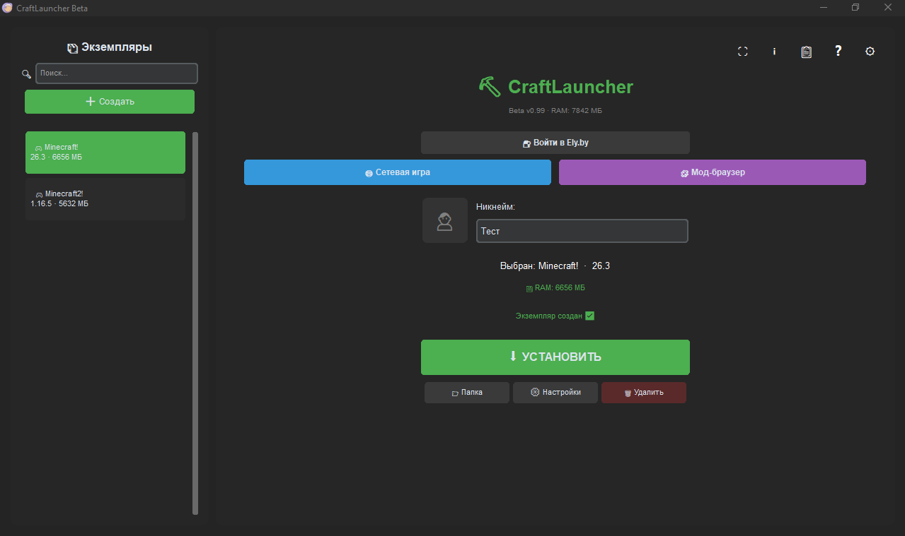
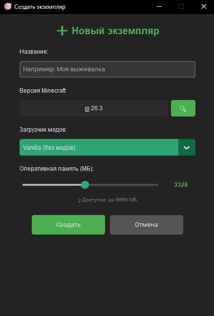
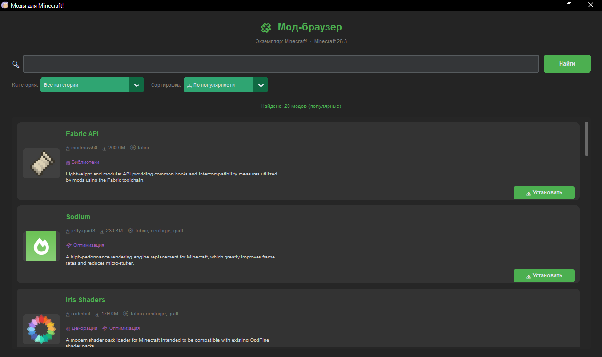
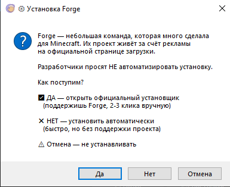
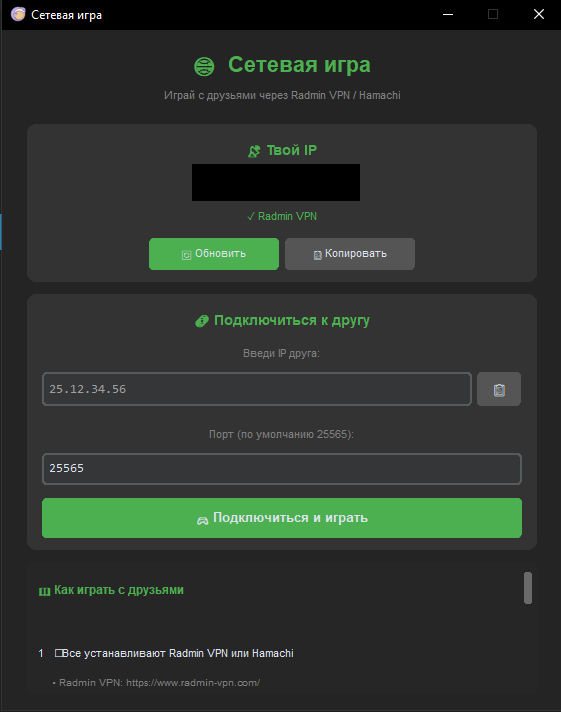
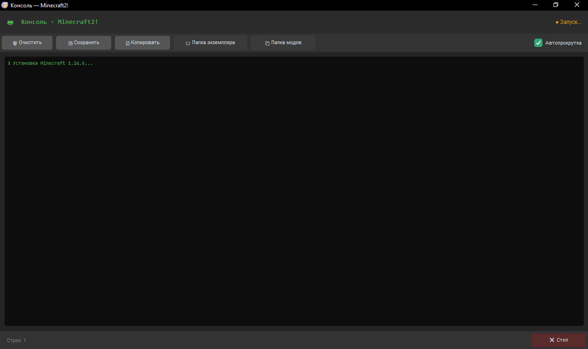

# ⛏ CraftLauncher

**Самодельный лаунчер Minecraft** — с экземплярами, Ely.by скинами, мод-браузером Modrinth и сетевой игрой.


---

## 📖 О проекте

**CraftLauncher** — это легковесный лаунчер Minecraft, написанный на **Python** с использованием **CustomTkinter**. Проект создан **в учебных целях** и полностью **открыт**.

### 🎯 Уникальные особенности

- **🤝 Уважение к Forge** — даём выбор между официальным установщиком и автоустановкой
- **🧩 Modrinth с фильтрами** — поиск модов по категориям (хоррор, магия, оптимизация и т.д.)
- **🌐 Сетевая игра** — играй с друзьями через Radmin VPN / Hamachi
- **🔒 2FA для Ely.by** — защита аккаунта от угона
- **📦 Полная изоляция** — каждый экземпляр в своей папке
- **🔓 Открытый код** — никакой телеметрии, никакой рекламы

---

## ✨ Возможности

### 📦 Управление экземплярами
- Создание **неограниченного** количества экземпляров
- **Своя папка** для каждого (миры, моды, конфиги — всё изолировано)
- **Слайдер RAM** для каждого экземпляра отдельно
- **Свой загрузчик** модов (Forge, Fabric или Vanilla)
- Быстрый **поиск** по экземплярам

### 🎯 Выбор версии Minecraft
- **Все релизы** с 1.0 до последней версии
- **Поиск** по названию (например, `1.16` → покажет `1.16.5`, `1.16.4`...)
- **Быстрые кнопки** популярных версий (`Последняя`, `1.20.1`, `1.16.5`, `1.12.2`, `1.7.10`)
- Автоматическая **сортировка** от новых к старым

### 🧩 Мод-браузер (Modrinth)
- **Поиск модов** по названию (JEI, Sodium, Create и т.д.)
- **Фильтр по категориям**:
  - 👻 Хоррор (cursed)
  - 🏔 Приключения (adventure)
  - ⚔ Снаряжение (equipment)
  - 🔮 Магия (magic)
  - ⚡ Оптимизация (optimization)
  - ⚙ Технологии (technology)
  - 🐉 Мобы (mobs)
  - И другие...
- **Сортировка**: популярные / новые / обновлённые / по релевантности
- **Автозагрузка** популярных модов при открытии
- **Иконки модов** (загружаются асинхронно)
- **Автопроверка зависимостей** — обязательные моды скачиваются автоматически
- **Установка в 1 клик** прямо из лаунчера

### ⚙ Установка загрузчиков (Forge / Fabric)
- **Прямо в настройках экземпляра** — не нужно пересоздавать
- **Прогресс-бар** установки
- **Автоопределение ID** версии загрузчика
- **🤝 Уважение к Forge**: диалог выбора
  - ✅ **Официальный установщик** — поддержишь разработчиков
  - ❌ **Автоустановка** — быстро, но без поддержки
- **Fabric** — автоматически, без лишних вопросов

### 🎨 Скины Ely.by
- **Превью скина** в главном окне (голова игрока)
- **Авторизация Ely.by** — вход через аккаунт
- **2FA поддержка** — код из Google Authenticator / Authy
- **Скины в игре** через `authlib-injector`
- **Безопасность**: токены **не сохраняются на диск** — только в памяти

### 🔐 Безопасность
- **2FA** для Ely.by аккаунта
- **Проверка токена** при запуске
- **Токены в памяти** — после закрытия лаунчера забываются
- **Никакой телеметрии** — лаунчер не отправляет данные
- **Только официальные источники** — Modrinth, Mojang, Ely.by

### 🌐 Сетевая игра
- **Играй с друзьями** через Radmin VPN / Hamachi
- **Автоопределение** VPN IP
- **Копирование IP** в буфер обмена
- **Быстрое подключение** — ввёл IP → играешь
- **Встроенная инструкция** прямо в окне

### 🖥 Консоль логов
- **Реальный вывод** Java в реальном времени
- **Подсветка**:
  - 🔴 Красный — ошибки
  - 🟡 Жёлтый — предупреждения
  - 🟢 Зелёный — успех
  - 🔵 Синий — системные сообщения
- **Сохранение** логов в файл
- **Копирование** в буфер обмена
- **Автопрокрутка** (вкл/выкл)

### ⚙ Дополнительно
- **Кастомный фон** — выбери свою картинку
- **Полноэкранный режим** (F11)
- **Тёмная / светлая / системная тема**
- **Логирование** в `launcher.log`
- **FAQ** (12+ вопросов) прямо в лаунчере
- **Changelog** — история всех версий
- **«О лаунчере»** — информация о версии

---

## 🚀 Быстрый старт

### Требования

- **Python 3.8+** — [скачать](https://www.python.org/downloads/)
- **Java** — [скачать](https://www.java.com/download/)
  - **Java 8** для Minecraft 1.16.5 и ниже
  - **Java 17** для 1.17 – 1.20.4
  - **Java 21** для 1.20.5+

### Установка

1. **Скачай проект:**
   ```bash
   git clone https://github.com/твой-ник/CraftLauncher.git
   cd CraftLauncher
   ```

2. **Установи зависимости:**
   ```bash
   pip install -r requirements.txt
   ```
   
   Или вручную:
   ```bash
   pip install customtkinter minecraft-launcher-lib psutil Pillow requests
   ```

3. **Запусти:**
   ```bash
   python main.py
   ```

### Файл `requirements.txt`

```
customtkinter>=5.2.0
minecraft-launcher-lib>=8.0
psutil>=5.9.0
Pillow>=10.0.0
requests>=2.31.0
```

---

## 📸 Скриншоты

### Главное окно


### Создание экземпляра


### Мод-браузер


### Установка Forge


### Сетевая игра


### Консоль


*(скриншоты появятся после публикации)*

---

## 🎮 Как пользоваться

### Первый запуск

1. **Запусти** `python main.py`
2. **Нажми ➕ Создать** слева
3. **Введи название** (например, «Выживалка»)
4. **Выбери версию** через 🔍 (например, `1.20.1`)
5. **Выбери загрузчик**: Vanilla / Forge / Fabric
6. **Настрой RAM** (рекомендуется 4096 МБ)
7. **Нажми Создать**

### Запуск игры

1. **Выбери экземпляр** в списке слева
2. **Нажми ▶ Играть** или **⬇ Установить**
3. Если версия **не установлена** — она **скачается автоматически**
4. После установки — игра **запустится**

### Скины Ely.by

1. **Зарегистрируйся** на [ely.by](https://ely.by)
2. **Загрузи скин** в личном кабинете
3. **Включи 2FA** (рекомендуется!) в настройках аккаунта
4. **Нажми 🔐 Войти в Ely.by** в лаунчере
5. **Введи логин и пароль** (и код 2FA, если включён)
6. Теперь скин виден **в игре** на серверах с Ely.by

**⚠ Важно:**
- Токен сохраняется **только пока лаунчер открыт**
- Закрыл лаунчер → при следующем запуске войди заново
- Это сделано **для безопасности** — токен не утечёт из файла

### Сетевая игра с друзьями

**Подготовка (один раз):**
1. Все игроки устанавливают [Radmin VPN](https://www.radmin-vpn.com/) или [Hamachi](https://vpn.net/)
2. Один игрок **создаёт сеть** (имя + пароль)
3. Остальные **подключаются** к этой сети

**Игра:**
1. **Хост** открывает мир в Minecraft: `Esc` → «Открыть для сети»
2. Хост **запоминает порт** (например, `54321`)
3. Хост открывает **🌐 Сетевая игра** в лаунчере
4. Хост **копирует свой IP** кнопкой 📋
5. Хост **отправляет IP и порт** друзьям
6. Друзья открывают **🌐 Сетевая игра**
7. Вводят **IP хоста** и **порт**
8. Нажимают **🎮 Подключиться и играть**

**⚠ Все должны быть в одной сети VPN!**

### Мод-браузер (Modrinth)

1. **Выбери экземпляр** в главном окне
2. **Нажми 🧩 Мод-браузер**
3. Откроется список **популярных модов** для твоей версии MC
4. **Выбери категорию** (например, `⚡ Оптимизация` для Sodium)
5. **Или введи название** в поиск (например, `JEI`)
6. **Нажми 📥 Установить** у нужного мода
7. **Все зависимости** скачаются автоматически

**⚠ Для работы модов нужен Forge или Fabric!**

### Установка Forge / Fabric

1. **Создай экземпляр** с нужной версией MC (или выбери существующий)
2. **Запусти игру 1 раз** — скачается ванильный Minecraft
3. **Открой ⚙ Настройки** экземпляра
4. **В секции «Загрузчик модов»** выбери Forge или Fabric
5. **Нажми 📥 Установить выбранный загрузчик**
6. **Для Forge** появится **диалог выбора**:
   - ✅ **ДА** — откроется официальный установщик (поддержишь Forge)
   - ❌ **НЕТ** — автоустановка (быстро, без поддержки)
7. **Дождись окончания** — ID версии сохранится автоматически
8. **Нажми ▶ Играть** — запустится Forge/Fabric


---

## 📖 Туториал: Установка Forge / Fabric

### 🎯 Сначала: определить версию Java

Forge/Fabric для разных версий MC требуют **разные версии Java**:

| Версия MC | Нужна Java |
|---|---|
| 1.16.5 и ниже | **Java 8** |
| 1.17 – 1.20.4 | **Java 17** |
| 1.20.5+ | **Java 21** |

**Как проверить установленную Java:**
```bash
java -version
```

Если нужной версии нет — [скачай Java](https://www.java.com/download/).

### 🔧 Установка Forge

#### Способ 1: Через лаунчер (рекомендуется)

1. **Создай экземпляр** в лаунчере с нужной версией MC
2. **Запусти игру 1 раз** — скачается ванильный Minecraft
3. **Открой ⚙ Настройки** экземпляра
4. **В секции «Загрузчик модов»** выбери **Forge**
5. **Нажми 📥 Установить выбранный загрузчик**
6. **Появится диалог**:
   - ✅ **ДА** — откроется официальный установщик Forge
     - Выбери «Install client»
     - Укажи путь: `...\.CraftLauncher\instances\<имя>\minecraft`
     - Нажми OK
   - ❌ **НЕТ** — автоустановка через библиотеку
7. **Дождись** окончания установки
8. **Нажми ▶ Играть** — запустится Forge

#### Способ 2: Вручную (если хочется полного контроля)

1. Открой [files.minecraftforge.net](https://files.minecraftforge.net/)
2. Найди свою версию Minecraft (например, **1.20.1**)
3. Нажми **Download Latest** (или **Recommended**)
4. Подожди 5 секунд → нажми **Skip** → скачается `.jar`
5. Запусти установщик
6. Выбери **Install client**
7. Укажи путь к `minecraft` папке экземпляра
8. Дождись завершения → нажми ▶ Играть в лаунчере

### 🧵 Установка Fabric

#### Через лаунчер (рекомендуется)

1. **Создай экземпляр** с нужной версией MC
2. **Запусти игру 1 раз** — скачается ванилла
3. **Открой ⚙ Настройки**
4. **В секции «Загрузчик модов»** выбери **Fabric**
5. **Нажми 📥 Установить**
6. **Дождись** — Fabric установится автоматически
7. **▶ Играть** — запустится Fabric

#### Вручную

1. Открой [fabricmc.net/use/installer](https://fabricmc.net/use/installer/)
2. Скачай **Fabric Installer**
3. Запусти
4. Выбери версию MC и **Load version** (последняя)
5. Укажи путь к `minecraft` папке экземпляра
6. Установи → ▶ Играть

### 📦 Установка модов

1. **Установи загрузчик** (Forge или Fabric) — см. выше
2. **Найди мод**:
   - Через **🧩 Мод-браузер** в лаунчере (рекомендуется)
   - Или на [Modrinth](https://modrinth.com/mods) / [CurseForge](https://www.curseforge.com/minecraft/mc-mods)
3. **Установи через лаунчер** (📥 кнопка) — мод скачается сам
4. **Или вручную**: положи `.jar` в папку `mods` экземпляра
5. **Перезапусти игру**

**⚠ Мод должен быть:**
- Для **той же версии MC**, что и игра
- **Совместим** с Forge/Fabric

---

## ❓ FAQ

### 🌐 Как играть с друзьями?

1. Все устанавливают **Radmin VPN** или **Hamachi**
2. Создают **общую сеть** (имя + пароль)
3. Открывают **🌐 Сетевая игра** в лаунчере
4. **Хост**: `Esc` → «Открыть для сети» → запомнить порт
5. **Хост копирует свой IP** кнопкой 📋
6. **Друзья** вводят IP и порт → **🎮 Подключиться**

**Подробнее — в окне «Сетевая игра» в лаунчере.**

### 🧩 Как установить моды?

1. **Сначала установи загрузчик** (Forge/Fabric)
2. **Выбери экземпляр** → **🧩 Мод-браузер**
3. **Найди мод** (поиск или категория)
4. **Нажми 📥 Установить**
5. Все зависимости скачаются **автоматически**

### 🔍 Как искать моды по категориям?

В **🧩 Мод-браузере** есть фильтр категорий:
- 👻 **Хоррор** (cursed) — страшные моды
- 🏔 **Приключения** — новые биомы, данжи
- ⚔ **Снаряжение** — оружие, броня
- 🔮 **Магия** — магические моды
- ⚡ **Оптимизация** — Sodium, Lithium
- ⚙ **Технологии** — машины, механизмы
- 🐉 **Мобы** — новые существа
- 📚 **Библиотеки** — для других модов

**Оставь поиск пустым** — покажет популярные моды!

### 🔒 Что такое 2FA и зачем оно нужно?

**2FA** (двухфакторная аутентификация) — это **дополнительная защита** аккаунта Ely.by.

Даже если кто-то **украдёт пароль**, без **кода из приложения** (Google Authenticator / Authy) он **не сможет войти**.

**Включи 2FA на ely.by в настройках аккаунта!**

### 🔐 Токен Ely.by сохраняется?

**НЕТ!** Токен хранится **только в памяти** пока лаунчер открыт.

- Закрыл лаунчер → токен забыт
- Открыл снова → войди заново

**Это безопаснее** — токен не утечёт из файла конфига.

### ⚙ Почему Forge ставится не автоматически?

**Forge** — небольшая команда. Их доход — **реклама** на официальной странице загрузки.

Разработчики **просят не автоматизировать** установку.

**Мы уважаем их просьбу**, но даём **ТЕБЕ выбор**:
- ✅ **Официальный установщик** — поддержишь Forge
- ❌ **Автоустановка** — быстро, но без поддержки

**TLauncher и другие лаунчеры этого выбора не дают. Мы — даём.** 🎓

### 🎯 Как поменять ник?

Введи ник в поле **«Никнейм»** в главном окне.

**⚠ При авторизации Ely.by** — ник берётся **из твоего аккаунта** и его нельзя изменить.

### 🖼 Как поменять фон?

**⚙ Настройки** → 🎨 Внешний вид → **📷 Выбрать фон** → выбери PNG или JPG.

**Сбросить:** кнопка **🔄 Сбросить**.

### 🗑 Как удалить экземпляр?

1. Выбери экземпляр **в списке слева**
2. Нажми **🗑 Удалить**
3. Подтверди

**⚠ Все миры и моды экземпляра удалятся!**

### 💾 Сколько RAM ставить?

- **Ванилла:** 2048-4096 МБ
- **С модами:** 4096-8192 МБ
- **Минимум:** 1024 МБ (может тормозить)

**⚠ Не ставь больше, чем есть в системе!**

### 🎮 Как играть с друзьями без VPN?

**Никак.** Minecraft не поддерживает P2P-соединение без посредника.

**Варианты:**
- **Radmin VPN** (рекомендуется)
- **Hamachi**
- **Публичный сервер** (с арендованным хостингом)

---

## 🐛 Troubleshooting

### ☕ Ошибка «Java не найдена»

**Решение:** установи Java и добавь в PATH.

1. Скачай [Java](https://www.java.com/download/)
2. При установке — отметь **«Add to PATH»**
3. Перезапусти лаунчер

**Версия Java:**
- MC 1.16.5- → Java 8
- MC 1.17-1.20.4 → Java 17
- MC 1.20.5+ → Java 21

### 🎮 Не запускается Minecraft

1. **Проверь Java:** `cmd` → `java -version`
2. **Открой консоль** — там будут ошибки
3. **Увеличь RAM** в настройках экземпляра
4. **Посмотри** `launcher.log` в папке лаунчера

### 🐛 Лаунчер крашится

1. Открой `%APPDATA%\.CraftLauncher\launcher.log`
2. Найди последние строки с `[ERROR]`
3. Создай **Issue** на GitHub с этими строками

### 🎨 Скин не отображается в игре

- **В одиночке:** подожди 5-10 секунд после входа
- **На сервере:** сервер должен поддерживать **Ely.by**
- **Проверь:** авторизован ли ты в Ely.by в лаунчере
- **Скин должен быть загружен** на ely.by

### ⚙ Forge не устанавливается

- **Скачай вручную** с [files.minecraftforge.net](https://files.minecraftforge.net/)
- **Проверь Java** — для 1.12.2 нужна Java 8
- **Путь** должен указывать на `minecraft` папку экземпляра
- **Для MC < 1.13** — автоустановка не работает, только вручную

### 🧩 Моды не работают

- **Установлен ли загрузчик?** (Forge/Fabric)
- **Тот ли путь?** — мод должен быть в `mods` экземпляра
- **Тот ли мод?** — для твоей версии MC и твоего загрузчика
- **Проверь логи** — там будет причина

### 🌐 «Connection refused» при подключении к другу

- Сервер (хост) **не открыт** для сети
- Хост не в той же **VPN-сети**
- **Порт** указан неверно
- **Firewall** блокирует соединение

### 🖥 Консоль не открывается

- Проверь настройку **«Показывать консоль»** в ⚙ Настройках
- Если выключена — консоль не появится
- Включи обратно для отладки

### 🐢 Лаунчер тормозит

- **Увеличь RAM** компьютера
- **Закрой другие программы** (браузер, игры)
- **Уменьши фон** — большие картинки жрут память
- **Обнови** библиотеки: `pip install --upgrade customtkinter`

---

## 📁 Где хранятся файлы

```
%APPDATA%\.CraftLauncher\
├── config.json               # настройки лаунчера
├── launcher.log              # логи
├── authlib-injector.jar      # для скинов Ely.by
└── instances\                # все экземпляры
    ├── Выживалка\
    │   ├── instance.json     # настройки экземпляра
    │   └── minecraft\        # игровые файлы
    │       ├── versions\     # версии
    │       ├── mods\         # моды
    │       ├── saves\        # миры
    │       ├── resourcepacks\# ресурспаки
    │       └── ...
    └── Forge 1.20.1\
        └── minecraft\
```

**Открыть папку:** ⚙ Настройки → 📂 Открыть папку лаунчера

---

## 🎯 Roadmap (планы)

### ✅ Сделано
- v0.1 — базовый запуск
- v0.5 — авто RAM
- v0.8 — консоль логов
- v0.85 — скины Ely.by
- v0.9 — полировка
- v0.92 — FAQ
- v0.93 — сетевая игра
- v0.94-96 — Modrinth
- v0.97 — 2FA
- v0.98 — загрузчики в лаунчере
- v0.99 — фильтры категорий

### 🔜 В планах
- 📦 Сборка в `.exe`
- 🔧 NeoForge + Quilt
- 📚 Модпаки (`.mrpack`)
- 🌐 Список серверов
- 🎨 Скины в списке экземпляров
- 🐧 Поддержка Linux/Mac
- ⚡ Оптимизация через JVM-флаги

---

## 🤝 Вклад в проект

Проект **открыт для PR**! Если хочешь помочь:

1. **Форкни** репозиторий
2. **Создай ветку**: `git checkout -b feature/новая-фича`
3. **Закоммить**: `git commit -m "Добавил X"`
4. **Пуш**: `git push origin feature/новая-фича`
5. **Создай Pull Request**

### 🐛 Нашёл баг?
Создай Issue с:
- **Описанием** проблемы
- **Шагами** воспроизведения
- **Скриншотом** или логом

### 💡 Есть идея?
Создай Issue с меткой `enhancement`.

---

## 📜 Лицензия

Проект под лицензией **MIT** — используй как хочешь. См. файл [LICENSE](LICENSE).

---

## 👤 Автор

**Твой Ник** — [GitHub](https://github.com/твой-ник)

Сделано с ❤️ для Minecraft-сообщества.

---

## ⚠️ Отказ от ответственности

Этот проект создан **в учебных целях**. 

- Автор **не несёт ответственности** за использование для **пиратских** версий Minecraft
- Лаунчер **не хранит** пароли и токены (кроме времени работы)
- Лаунчер **не собирает** телеметрию
- Лаунчер использует **только официальные источники**: Modrinth, Mojang, Ely.by

**Купи лицензию**, если можешь — [официальный сайт Minecraft](https://www.minecraft.net/).

---

## 🙏 Благодарности

- **[minecraft-launcher-lib](https://github.com/minecraft-launcher-lib/minecraft-launcher-lib)** — основа для запуска
- **[CustomTkinter](https://github.com/TomSchimansky/CustomTkinter)** — современный UI
- **[Modrinth](https://modrinth.com/)** — открытая платформа модов
- **[Ely.by](https://ely.by/)** — скины и авторизация
- **[authlib-injector](https://github.com/yushijinhun/authlib-injector)** — для скинов в игре
- **[Forge](https://files.minecraftforge.net/)** и **[Fabric](https://fabricmc.net/)** — загрузчики модов

---

## ⭐ Понравился проект?

Поставь **звезду** на GitHub! Это мотивация развивать проект дальше.

```
    ⭐ Star ⭐
```

---

**Приятной игры!** ⛏🎮